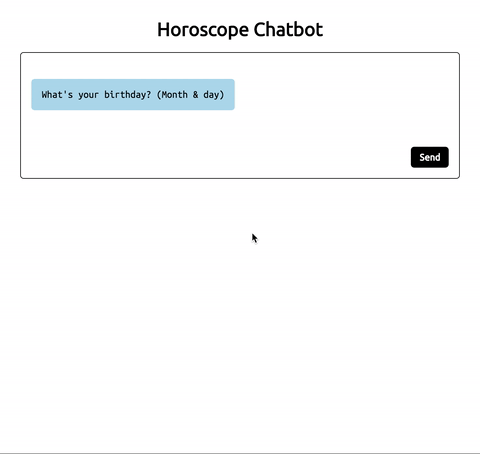

# Horoscope Chatbot

Simple horoscope chatbot

## Installation

If you have Node.js managed with [Node Version Manager](https://github.com/creationix/nvm.git), you can first `nvm install` in the project root to get the optimal version.

Otherwise, just ensure you have Node.js 4.x installed; the `index.js` employs ES6 features.

## Getting Started

Provided you have Node.js 4.x, the setup is

    npm install
    npm start

in the project root and visit http://localhost:9000 in your browser.

## Example

